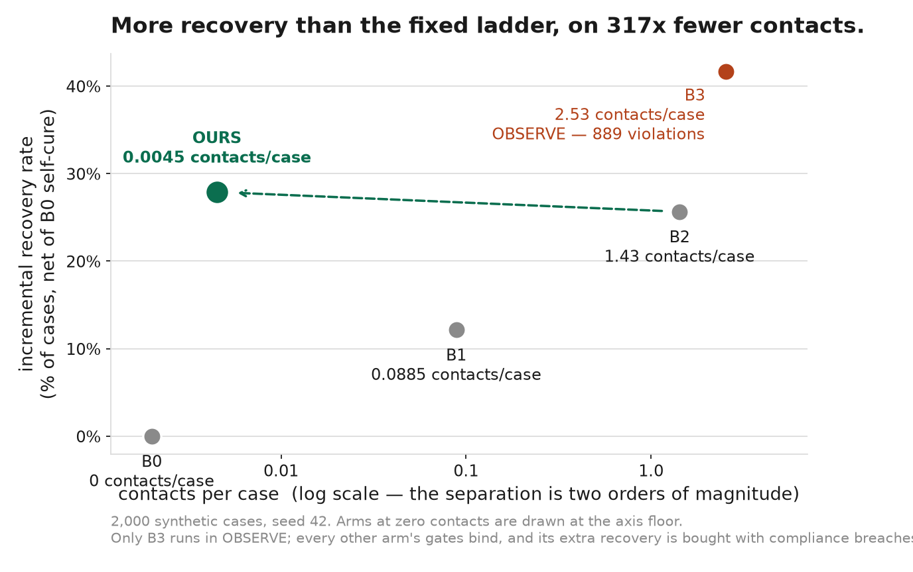
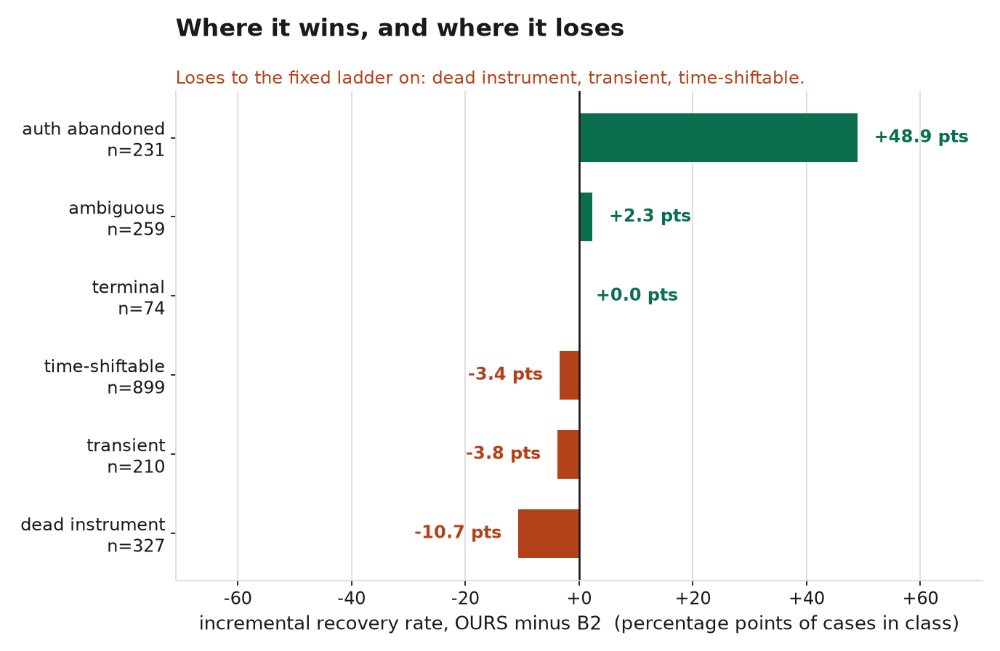
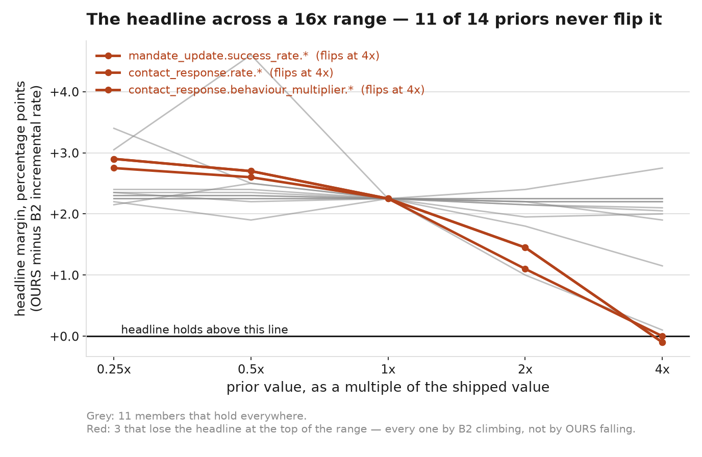
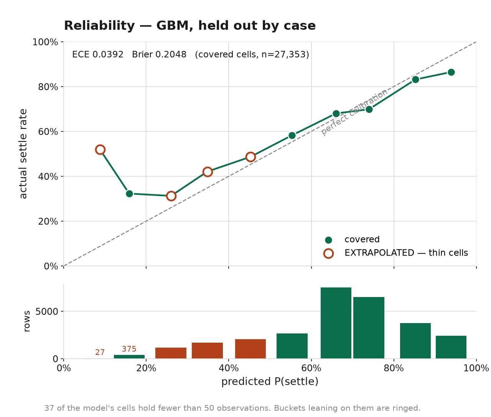

# settle

**9 contacts. 2,000 cases. More money back than a fixed dunning ladder that sent 2,852.**

`settle` is a recovery agent for failed subscription mandates that is correct
when it cannot trust what it is told about outcomes. It is **simulated at scale
and real at the edges**: the 2,000-case batch below is synthetic and seeded, and
one payment link in this repo — `plink_TWr7e2EFJ8ITvn` — is a real Razorpay
test-mode object that was created over the network, paid with a test card, and
reported back by a signature-verified webhook.

Being simulated is the point, not an apology. The simulator holds a
`HiddenTruth` the agent never sees, which is the only reason we can report how
often the system was **wrong about an outcome** rather than only what it did. A
live pilot cannot produce that number, and it is the number this project exists
to produce.

---

## 1. Headline metrics

2,000 cases, seed 42, 60-day observation horizon. Incremental means net of the
B0 do-nothing arm's natural recovery — a case that cures on its own is not ours
to claim.

| | **OURS** | B2 fixed ladder | B1 single retry | B3 max pressure | B0 do nothing |
|---|---|---|---|---|---|
| Incremental recovery rate | **27.90%** | 25.65% | 12.15% | 41.65% | 0.00% |
| Incremental recovery (₹) | **391,664** | 372,686 | 176,029 | 565,144 | 0 |
| Contacts | **9** | 2,852 | 177 | 5,067 | 0 |
| Contacts per case | **0.0045** | 1.426 | 0.0885 | 2.5335 | 0 |
| Dispatches (all actions) | 6,993 | 6,576 | 1,388 | 13,737 | 0 |
| Cost per ₹100 recovered | **₹0.0895** | ₹0.2714 | ₹0.0644 | ₹4.7703 | — |
| **Silent failure rate** | **1.45%** | 5.30% | 2.30% | 52.70% | 0.00% |
| **Reported minus reconciled** | **−200 cases** | −194 | −293 | −71 | −450 |
| Compliance violations | **0** | 0 | 0 | **889** | 0 |
| Gate mode | ENFORCE | ENFORCE | ENFORCE | OBSERVE | ENFORCE |



**B3 recovers more than we do, and it is not a competitor.** It runs in OBSERVE:
the gates are evaluated and their verdicts do not bind. It buys 41.65% with 889
compliance violations — 810 contacts outside the permitted window, 79 after an
opt-out — and a 52.70% silent failure rate. It is the upper bound on what an
unguarded system extracts, printed so the cost of the guardrails is visible
rather than assumed away.

### The two rows nobody else prints

**Silent failure rate** is what the reconciliation pass finds by comparing the
ledger against what the money actually did, independently of the executor.
OURS's 1.45% is 23 cases marked recovered that never settled (SF-1) and 6 that
settled and then reversed (SF-7). B2's 5.30% includes 17 customers who had
already paid and were contacted again (SF-2) and 57 promises that passed their
date with no follow-up (SF-4). OURS has zero of both.

**Reported minus reconciled** is the gap between what the agent believed and
what happened. Every arm's is negative, and that is the thesis in one number:
OURS believed 815 cases recovered; 1,015 actually did. **200 settlements never
reached the agent at all.** A system that trusted its own webhook feed would
under-report its own recovery by 20% and keep chasing 200 people who had already
paid. Ours does not, because reconciliation — not the ledger — decides what
recovered.

### Restraint

> OURS dispatches 6,993 actions against B2's 6,576. It is more active and less
> intrusive. Far fewer CONTACTS, not less work.

The restraint is in *contacts*, not in effort. `settle` retries, switches rails
and requests mandate updates more than the ladder does. It just does not message
people, because in this world messaging them mostly is not worth what it costs.

**That is a claim about contacts, not about our contacts being better.** Seven of
the fourteen swept priors leave OURS completely unmoved, because a policy making
9 contacts in 2,000 cases cannot be affected by any prior describing what happens
when you contact someone. A reader who takes the sensitivity result as evidence
of a robust *contact policy* has read it wrong.

### Where it wins, and where it loses



The entire margin is one class. `auth_abandoned` — where the recovery path is a
rail switch, not a retry — goes to OURS by **48.9 points**. It **loses** to the
fixed ladder on three of six classes, including the largest: `dead_instrument`
by 10.7 points, `transient` by 3.8, and `time_shiftable` — 899 of 2,000 cases —
by 3.4.

A single incremental rate hides that shape entirely. The chart is here rather
than in an appendix because a results section that shows only the wins is a
limitations section displaced into a picture.

### Sensitivity



Fourteen priors, each swept from 0.25x to 4x of its shipped value. **Eleven never
flip the headline across the full 16x range.** Three do, at the top of the range:
`mandate_update.success_rate.*`, `contact_response.rate.*` and
`contact_response.behaviour_multiplier.*` — every one by B2 climbing rather than
by OURS falling.

`contact_response.rate.*` is the one a sceptic should press on. It governs how
often a dispatched contact makes a customer go and pay, it is ASSERTED, and it is
ours. In a world where messaging works four times better than we assume, the
ladder wins. That flip is in exactly the direction you would guess.

---

## 2. Architecture

```mermaid
flowchart LR
  subgraph SIM["settle/sim/ — the world (agent never sees this)"]
    GEN[generator.py<br/>seeded batch] --> TRUTH[truth.py<br/>HiddenTruth]
    TRUTH --> WORLD[world.py<br/>response model]
    WORLD --> OBS[observability.py<br/>drops · duplicates · delays · reorders]
  end

  subgraph AGENT["settle/agent/ + settle/policy/ — the decision"]
    DIAG[diagnose/taxonomy.py<br/>decline code to class] --> EST[estimator.py<br/>P settle, calibrated]
    EST --> POL[policy.py<br/>EV = uplift over do_nothing]
    POL --> GRID[policy/grid.py<br/>closed action grid]
  end

  subgraph BOUND["settle/policy/ + settle/execute/ — the boundary"]
    GATES[gates.py<br/>G1-G11 ENFORCE] --> STOPS[stops.py<br/>S1-S7]
    STOPS --> EXEC[executor.py<br/>the only module that acts]
  end

  subgraph TRUST["settle/recon/ — does not trust the executor"]
    RECON[reconcile.py<br/>belief vs ActualOutcome] --> SF[silent_failures.py<br/>SF-1 to SF-7]
  end

  OBS -->|ReportedOutcome| DIAG
  GRID --> GATES
  EXEC --> WORLD
  EXEC --> LEDGER[(audit/chain.py<br/>hash-chained ledger)]
  LEDGER --> RECON
  TRUTH -.->|only recon may read truth| RECON
  SF --> METRICS[eval/report.py<br/>out/charts/metrics.json]

  EDGE[api/webhook.py<br/>real Razorpay webhook] --> LEDGER
```



Three rules hold the shape:

- **INV-8.** Exactly three packages may read `settle.sim.truth`: `sim` constructs
  it, `execute` produces it at the world boundary, `recon` compares belief
  against it. A test walks the AST of every other module to assert none imports
  it. An unstated exception is how an invariant dies.
- **INV-5.** The audit entry is written *before* the dispatch, and flushed. An
  entry written afterwards does not exist when the process dies mid-dispatch,
  and the next run contacts the customer again — SF-3 harassment caused by the
  audit system meant to prevent it.
- **One gate implementation.** Gates are never bypassed, skipped or reimplemented
  per arm. Arms differ in what they choose, never in what binds them.

---

## 3. Reliability



The shipped estimator is a gradient-boosted model over 45 features, held out
**by case** rather than by row — a row-wise split would leak, because fifteen
decisions from one case share its hidden recoverability. ECE **0.0392**, Brier
**0.2048** over 27,353 covered rows.

Buckets are ringed where they lean on cells the model has barely seen. **37 of
the model's cells hold fewer than 50 observations**, and the bottom panel shows
why that matters: the leftmost point is the largest deviation on the diagram and
it rests on 27 rows. Marking them is the difference between a reliability
diagram and a reassuring picture.

### The calibration trade, stated plainly

We shipped the **worse-calibrated** of two models, on purpose.

| | overall ECE | uplift ECE | decisions it cannot separate |
|---|---|---|---|
| **GBM** (shipped) | **0.0392** | **0.0176** | 0.0% |
| GBM + isotonic (rejected) | **0.0160** | 0.0193 | 11.5% |

The rejected model is more than twice as accurate on the *level* of the
probability. §10.2 computes expected value as uplift over `do_nothing`, so the
policy consumes only the **difference** between two probabilities and never
either one alone. Isotonic regression flattened that difference — it returned an
identical probability for every option on 11.5% of real multi-option decisions,
which makes the argmax a coin toss on those cases whatever the calibration says.

So the model is fit for the decision it was selected for and measurably worse for
any other. If you read a probability off it and act on the level, you are using a
number 2.5x less accurate than one we could have shipped. Both numbers are here
rather than the flattering one.

---

## 4. Reproduce it

```bash
python -m venv .venv && source .venv/bin/activate
pip install -r requirements.txt

# the batch, the arms, the reconciliation, every headline number
python -m settle.eval.report --cases 2000 --seed 42

# the four charts, from that artefact
python -m settle.eval.charts
```

`report` writes `out/charts/metrics.json`. **Every number in this README comes
from that file**, and test `CHT-3` asserts it — a figure with no artefact behind
it does not go in. That is not tidiness: this project's whole claim is that a
recovery number is worth what the evidence behind it is worth, and a README
quoting an unbacked rate would be committing the error it was written to
criticise.

The full suite, including the sensitivity sweep and the 10,000-case runs:

```bash
pytest                    # fast suite
pytest -m ""              # everything, including the slow runs
python -m settle.eval.sensitivity     # ~21 minutes, writes out/sensitivity.json
```

The Razorpay edge runs without credentials:

```bash
python scripts/razorpay_demo.py       # MOCK_SANDBOX, no keys needed
```

---

## 5. How the thresholds were chosen

**Model selection is on the calibration of the uplift, subject to a resolution
floor.** Not on overall ECE. §10.2 subtracts `p_settle(do_nothing)` from every
action, so the quantity the policy is sensitive to is the difference. A model can
win overall and lose the difference, and shipping it would mean selecting on a
number the policy never uses. The resolution floor exists because uplift ECE is
blind to a scorer that has stopped discriminating: a model returning one number
for every option is a constant, whatever its calibration says. Any candidate flat
on more than 10% of 600 real multi-option decisions is not selectable, which is
what rejected the isotonic variant at 11.5%.

**The action grid is fixed and shared.** Eight hour offsets — 0, 6, 18, 30, 48,
72, 120, 168 — bounded by the 30-day decision horizon. EXPLORE and OURS enumerate
candidates through one function and neither may widen or narrow it locally. An
estimator trained on one grid and queried on another has zero coverage exactly
where it is asked to predict, and its held-out calibration would look fine
because the held-out set shares the blind spot.

**The extrapolation threshold is 50 observations per cell**, chosen before the
model was fit rather than tuned until the coverage looked acceptable. Cells below
it are named in the output and excluded from the headline ECE, and the excluded
count is reported alongside.

**Gate constants are not tuned at all.** `notice_lead_hours = 24` is the
project's only SOURCED prior, from RBI/DPSS/2026-27/396. The rest — contact
windows, frequency caps, retry budgets — are fixed a priori and swept in §15.2,
never adjusted against a result. Tuning a cost against incremental recovery would
make the contact-restraint finding circular; tuning it against contact count
would make the recovery finding circular.

---

## 6. Priors and provenance

The sourcing pass attached a public citation to every parameter row that could
carry one. The result:

| tier | rows |
|---|---|
| SOURCED | **1** |
| DERIVED | **3** |
| ASSERTED | **184** |
| **total** | **188** |

**184 of 188 are our judgement, and the reason is structural.** Indian payments
data is published as system-wide aggregate — NPCI's monthly UPI volumes, RBI's
e-mandate circulars, issuer-level decline summaries. This model concerns the
*conditional* behaviour of a customer whose recurring debit has already failed:
how likely they are to pay after a second retry at a different hour, how much
patience they have before a message becomes harassment, whether a dead mandate
can be revived. Nobody publishes that. It sits inside individual merchants' data
and does not come out.

Near-miss rows were left ASSERTED deliberately rather than citing a source that
nearly fits, each carrying its near-miss in its own cell. This is why the
sensitivity sweep is in the results section above and not in an appendix — it is
the only honest answer available when the parameters are mostly yours.

The pass paid for itself on our own model rather than on citations. It found
`settlement_lag_h.mean` set to 38 hours against Razorpay's documented T+2
working-day cycle with a 48-hour floor — 92% of settlements landing faster than
the vendor says is possible. It is 56 now, and DERIVED. It also found that G9
enforced the e-mandate notice window but not RBI's 24-hour lead, which the
runner's 24-hour cadence had been supplying by coincidence. A compliance gate
that holds because of an unrelated constant is not enforced, it is lucky.

Full table with per-row citations: [`PRIORS.md`](PRIORS.md).

---

## 7. Known limitations

Full list, with the cost of each: **[`KNOWN_LIMITATIONS.md`](KNOWN_LIMITATIONS.md)**.

The five that would change how you read the numbers above:

1. **The auditor is validated only in simulation.** The reconciliation mechanism
   transfers to production — against live Razorpay it is a lagged batch join on
   `payment_id` against the Settlement Recon endpoint, which is exactly the
   architecture built here, forced by the real API. What does not transfer is our
   ability to measure the auditor's own accuracy: in simulation we know what it
   missed, in production we would not. Read `silent_failure_rate` as "this
   detector catches N% *in a world where we know the answer*", and nothing
   stronger. It has never been pointed at live money.

2. **Retry timing was a hypothesised differentiator and it is not.** We tested it
   and withdrew the claim. Median spread across the eight offsets is 3.7
   percentage points; the timing features rank 26th to 37th of 45. A coarse
   signal exists; a liquidity curve does not.

3. **The headline flips at 4x on `contact_response.rate.*`**, an asserted number
   that we set, in the direction a sceptical reader would guess.

4. **Incremental scoring discards timing value, understating our own result.** A
   case OURS recovers on day 3 and B0 recovers on day 28 scores as zero, despite
   25 days of avoided churn risk. We keep the conservative definition because the
   alternative — attribution windows — is where recovery products go to flatter
   themselves.

5. **Three world bugs shipped and were fixed during the build**, each of which
   invalidated a headline first: scheduling fired immediately, dead instruments
   were unrecoverable, and contacts could not produce settlements. The third made
   "same recovery, far fewer contacts" true by construction for four
   checkpoints, and it looked exactly like a win.

---

## Simulated at scale, real at the edges

**The batch is synthetic.** All cases come from a seeded generator in
`settle/sim/`. Nobody's card was declined and no money moved.

**One object is real.** `out/razorpay_demo.json` records a Razorpay **test-mode**
payment link created against the live API, paid in a browser, and reported back
by a real webhook through a real tunnel.

| | |
|---|---|
| Payment link | `plink_TWr7e2EFJ8ITvn` |
| Payment (captured) | `pay_TWrM4OohnxgMOu` |
| Order | `order_TWr8cmMDYa9lph` |
| Joined to case | `case_000000` — ₹3,256.35, card, `insufficient_funds` |
| Webhooks received | `payment.failed`, `payment.captured`, `payment_link.paid` |

It took two attempts, and the first one failing is the more useful half. Razorpay
declined it with `international_transaction_not_allowed` — the card used was
Razorpay's *international* test card and this account accepts domestic Indian
cards only. That is a property of the test account, not a defect in `settle`, and
a real decline beside a real capture in one verifiable chain is worth more than a
clean single capture.

Each webhook was verified by HMAC SHA256 **before its body was parsed**, checked
against an event-id idempotency store, and written to the hash-chained ledger.

**The artefact verifies itself.** For each row of its chain:

```
sha256(prev_hash.encode("ascii") + canonical_json(projection)).hexdigest() == hash
```

with `canonical_json` from `settle.schema.canonical` and the first `prev_hash`
being 64 zeros. Test `RZP-4` is that recomputation.

What the chain covers is a **contact-free projection** of each webhook, not the
raw event. Razorpay's checkout SMS-verifies the payer's phone number, so a real
payment carries a real mobile number and no placeholder completes one. The
projection is built from a fixed allow-list of fields; contact fields are absent
from its schema — not blanked, not masked, with no branch that admits them. The
rejected alternative was to hash the raw event and strip the number before
committing, which produces a hash no reader can recompute: *"trust me, it
verified before I edited it"* is the claim this project exists to refuse, and
making it about our own integrity would be self-refuting.

Every payment link record carries an explicit `source`:

| `source` | What it is |
|---|---|
| `RAZORPAY_TEST_MODE` | A real object in Razorpay's test mode. |
| `MOCK_SANDBOX` | Constructed locally. `MOCK_plink_…`, on the reserved `.invalid` TLD. |

The pairing is validated by the model and the records are frozen, so a
locally-minted id cannot be relabelled real. Paste a mock id into the Razorpay
dashboard and it finds nothing; click a mock URL and it does not resolve. Both
failures are loud, which is the point — the quiet version of this mistake is a
demo that shows a synthetic id and calls it a payment.
